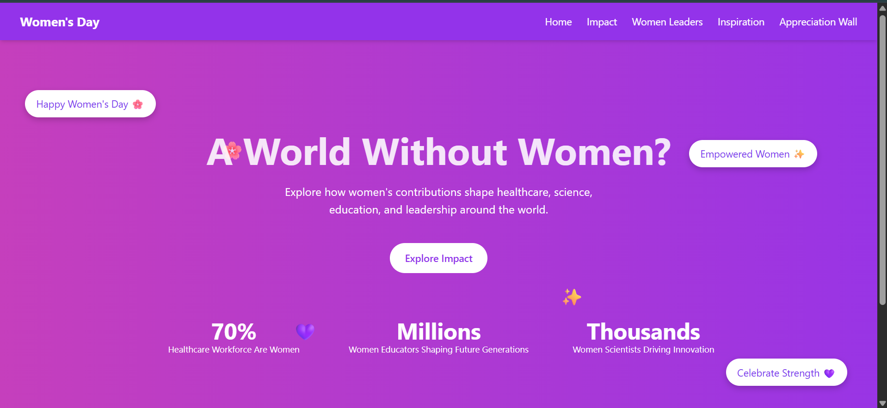
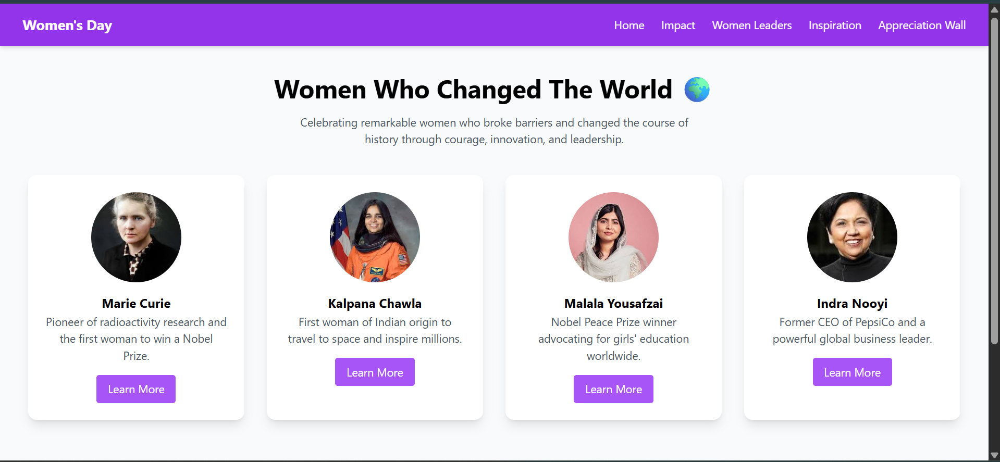
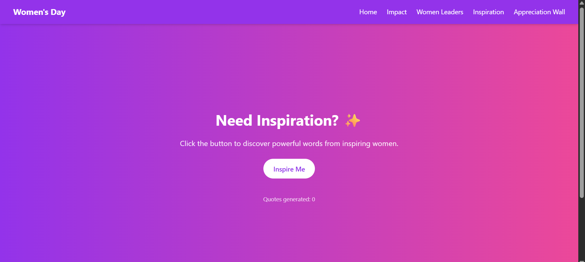
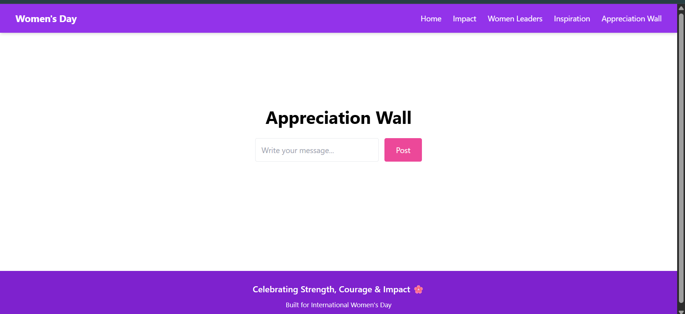

# 🌸 Women's Day Interactive Web Experience

An interactive web platform built to celebrate **International Women’s Day** by highlighting women's contributions across healthcare, science, education, and leadership.

Instead of a simple greeting website, this project creates an **interactive storytelling experience** where users can explore statistics, discover inspirational leaders, generate motivational quotes, and share appreciation messages.

---

# ✨ Key Features

## 🎉 Interactive Home Page

* Animated gradient background
* Floating celebration bubbles
* Clickable bubble burst animation with greetings
* Real-world statistics counters

## 📊 Impact Visualization

Interactive simulation demonstrating women's contributions in major sectors:

* Healthcare 🏥
* Science 🔬
* Education 🎓

Features:

* Real-world statistics
* Dynamic progress indicators
* Interactive sector exploration

## 🌍 Women Leaders Gallery

Profiles of influential women who changed the world.

Includes:

* Marie Curie
* Kalpana Chawla
* Malala Yousafzai
* Indra Nooyi

Each profile links to external biographies for deeper learning.

## 💡 Inspiration Generator

Users can generate motivational quotes from inspiring women.

Features:

* Random quote generator
* Share quotes directly on:

  * WhatsApp
  * Twitter (X)
  * Facebook
  * LinkedIn
  * Email

## 💜 Appreciation Wall

A community section where users can write messages celebrating women who inspire them.

Encourages participation and positive engagement.

---

# 🛠 Tech Stack

Frontend Framework
React

Build Tool
Vite

Styling
Tailwind CSS

Routing
React Router

Key Concepts Used

* React State Management
* Conditional Rendering
* Interactive Animations
* Event Handling
* Responsive Design

---

# 🎨 UI/UX Highlights

* Interactive storytelling approach
* Smooth animations
* Responsive layout
* Social sharing functionality
* Community participation

The project focuses on **engagement, awareness, and inspiration**.

---

# 📸 Screenshots

(Add screenshots after uploading images)

Example:










---

# 🚀 How to Run the Project

Clone the repository

```bash
git clone https://github.com/Suhail-8800/womens-day.git
```

Navigate into the project folder

```bash
cd womens-day-interactive-website
```

Install dependencies

```bash
npm install
```

Run the development server

```bash
npm run dev
```

Open the application

```
http://localhost:5173
```

---

# 🎯 Project Objective

This project was created to:

* Celebrate **International Women’s Day**
* Raise awareness about women's global impact
* Demonstrate modern frontend development using React
* Create an engaging interactive user experience

---

# 💡 Possible Future Improvements

* Backend integration for storing appreciation messages
* User authentication for message posting
* More global statistics and visualizations
* Additional inspirational women profiles
* Advanced animations and storytelling features

---

# 👨‍💻 Author

**Suhail Rajput**

Computer Science Student | Aspiring Software Developer

GitHub
https://github.com/Suhail-8800

LinkedIn
https://www.linkedin.com/in/suhail-rajput-64158722b/

---

# 🌸 Happy Women's Day

> "There is no limit to what we, as women, can accomplish."

— Michelle Obama
